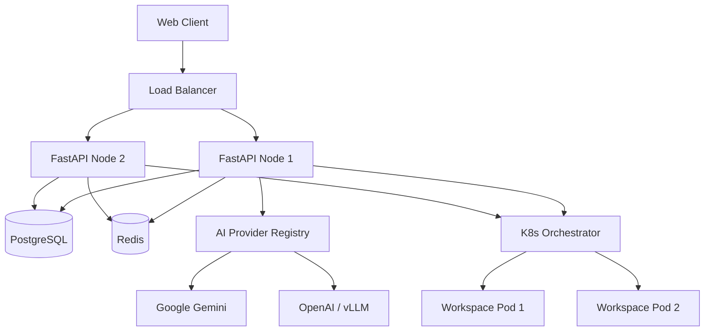

# Colab.ai — Architecture V2

This document describes the updated architecture of Colab.ai, focusing on the scalability improvements implemented in version 2.

## High-Level Architecture

Colab.ai uses a modern, distributed architecture designed for horizontal scalability, high availability, and multi-tenant isolation.

## Key Scalability Upgrades

### 1. PostgreSQL + Alembic (Database Layer)
The original SQLite database was replaced with PostgreSQL.
- **Why:** SQLite locks the entire database file during writes, creating a massive bottleneck under concurrent user load.
- **How:** Integrated `psycopg2`, configured SQLAlchemy connection pooling, and added Alembic for robust schema migrations.

### 2. Redis + Socket.io (Real-Time Layer)
The in-memory Socket.io participant tracking was moved to Redis.
- **Why:** In a multi-node deployment, users connecting to different FastAPI replicas could not see each other's cursor movements or terminal output.
- **How:** Implemented `socketio.AsyncRedisManager` for cross-replica pub/sub event fan-out, and moved session state to Redis Hashes.

### 3. Kubernetes Orchestrator Abstraction
Direct Docker SDK calls were abstracted behind a `ContainerOrchestrator` interface.
- **Why:** Direct Docker socket access limits the app to a single massive host.
- **How:** Built a pluggable orchestrator pattern. Developers can use `DockerOrchestrator` locally, while production uses `KubernetesOrchestrator` to schedule sessions as Pods across a cluster with LimitRanges and NetworkPolicies.

### 4. Tunnel Broker Service
Cloudflare tunnels are now managed by a background broker service.
- **Why:** Users could infinitely spawn tunnels, eating server resources and risking rate limits. Dead tunnels were never cleaned up.
- **How:** Added `TunnelBroker` with per-user quotas (HTTP 429 enforcement), Redis-backed state tracking, and a background TTL task that automatically reaps idle processes.

### 5. Multi-Vendor AI Provider Registry
The AI agent router was abstracted into a `ProviderRegistry`.
- **Why:** Hardcoding a single AI provider (Gemini) creates a single point of failure and vendor lock-in.
- **How:** Implemented `AIProvider` base class with Gemini and OpenAI-compatible implementations. The registry automatically handles failovers if the primary AI endpoint goes down.

## Authentication & RBAC

The system employs a 4-level Role-Based Access Control hierarchy:
`Organization → Team → Role → Permission`

- **Viewer:** Read-only access
- **Member:** Can create and edit workspaces
- **Admin:** Full management access
- **Owner:** Organization owner

All endpoints (including WebSocket connection upgrades) are secured via JWT validation.
